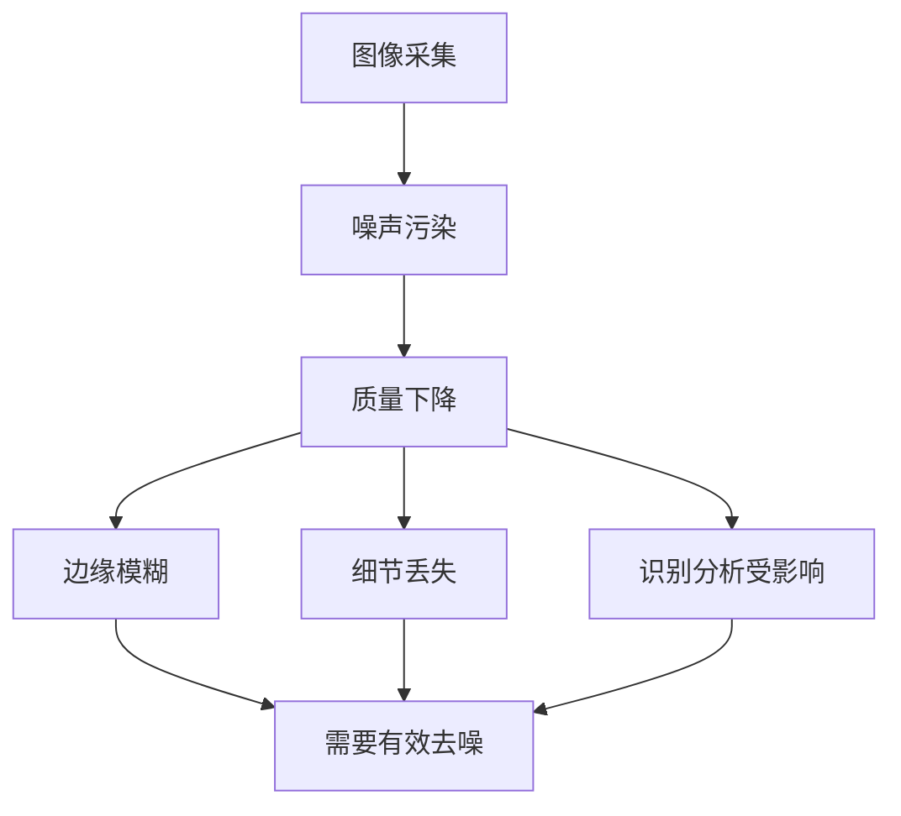
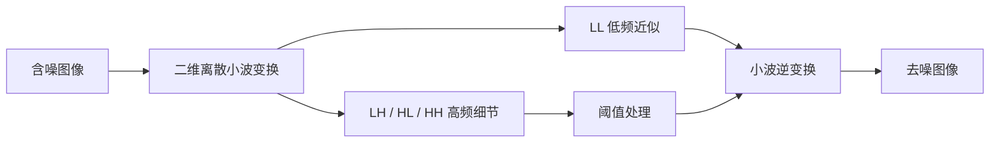
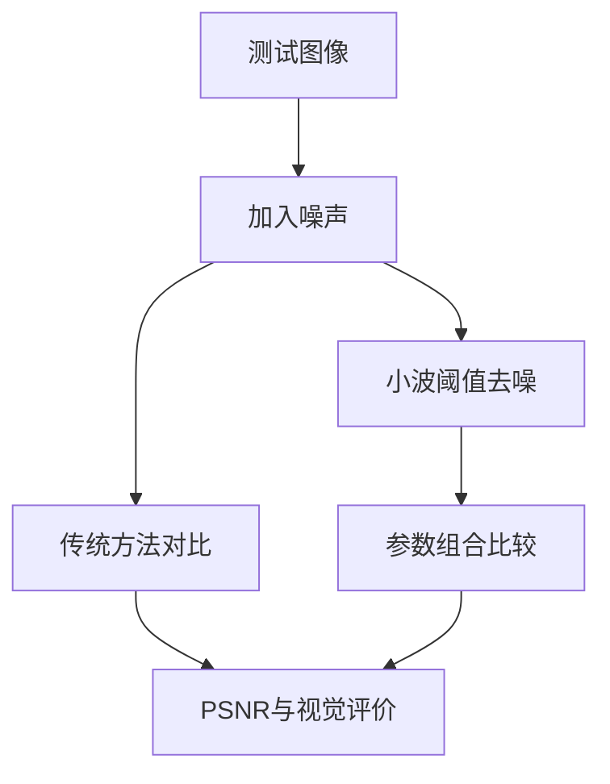
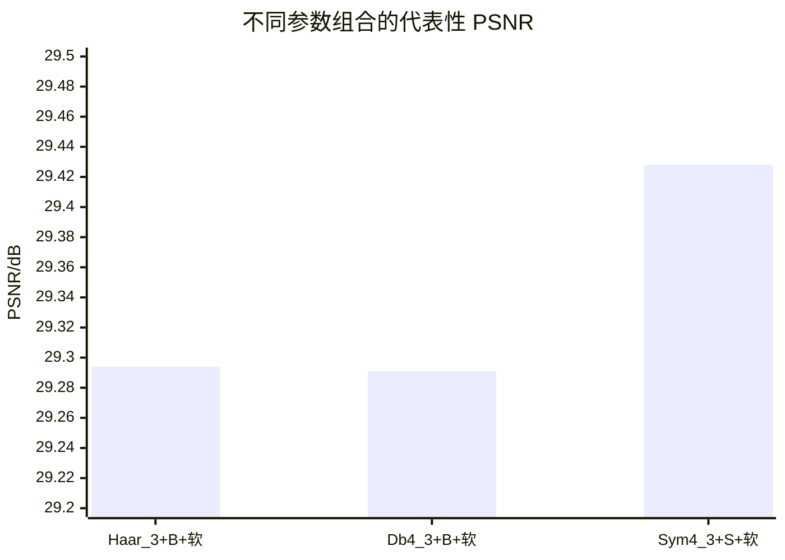

# 图像阈值去噪方法的实现

苏州大学电子信息工程系

答辩人：王卿

指导教师：邹玮

---
layout: image-right
image: /public/page2.jpg
---

# 研究背景

- 图像广泛应用于医学诊断、遥感监测、工业检测等场景
- 图像在采集、传输、存储中容易受噪声污染，影响后续识别与分析
- 传统滤波方法常出现“降噪”和“保边缘”难以兼顾的问题
- 这使得图像去噪成为图像预处理中的关键环节

---
layout: two-cols
---

# 研究重点

并不是单纯“把噪声去掉”，而是在去噪过程中尽量避免破坏图像本身的重要结构。

研究关注的核心问题是：

- 抑噪能力
- 边缘保持

进一步说：

- 去噪过强，图像会变得平滑，边缘和纹理细节容易丢失
- 去噪过弱，噪声残留明显，会影响后续识别与分析
- 因此需要找到抑噪与保边缘之间的平衡点

::right::

---
layout: two-cols
---

# 研究内容

## 主要工作

1. 分析均值滤波、中值滤波、低通滤波等传统方法的优缺点
2. 实现二维离散小波变换的图像分解与重构
3. 实现 VisuShrink、SureShrink、BayesShrink 三种阈值策略
4. 实现硬阈值、软阈值、半软阈值三种阈值函数
5. 在标准测试图像上进行系统对比实验

::right::

---

# 研究内容

## 研究目标

| 目标 | 说明 |
| --- | --- |
| 完整原型 | 完成从加噪、分解、阈值处理到重构的去噪流程 |
| 性能比较 | 明确不同小波基、阈值方法和阈值函数的差异 |
| 效果追求 | 提高 PSNR，并保持边缘细节、抑制振铃效应 |

---

# 研究方法

| 模块 | 论文实现 | 作用 |
| --- | --- | --- |
| 小波基 | Haar / Db4 / Sym4 | 控制分解与重构特性 |
| 阈值选取 | VisuShrink / SureShrink / BayesShrink | 决定抑噪强度 |
| 阈值函数 | 硬 / 软 / 半软 | 平衡细节保留与平滑效果 |

---
layout: two-cols
---

# 关键算法说明

## 小波基

- Haar：实现简单，计算量小
- Db4：正则性与平滑性更好
- Sym4：近似对称，视觉平滑性较好

小波基决定图像的分解方式，也决定噪声与边缘信息在各子带中的分布。
 
论文对比发现，Db4 在平滑性、细节保持和整体稳定性之间更均衡，因此后续实验中表现更优。

::right::

| 小波基 | 特点 |
| --- | --- |
| Haar | 结构简单，计算量小 |
| Db4 | 平滑性较好，综合表现稳定 |
| Sym4 | 近似对称，视觉效果更柔和 |

---
layout: two-cols
---

# 小波基处理过程演示

## 二维小波分解直观过程

- 原始图像经过小波基分解后，会被映射到不同频率子带
- `LL` 主要保留整体轮廓，`LH / HL / HH` 则对应不同方向的细节信息
- 这一步为后续阈值处理区分噪声与有效边缘提供了基础

::right::

<WaveletProcess />

---
layout: two-cols
---

# 关键算法说明

## 阈值策略

### 核心思路

- 阈值策略用于确定高频子带系数的阈值大小
- 目标是在抑制噪声的同时尽量保留真实边缘与纹理
- 阈值过大易造成细节丢失，阈值过小则会带来噪声残留

### 常用策略

- `VisuShrink`：通用阈值，方法简单
- `SureShrink`：按子带自适应选取阈值
- `BayesShrink`：基于统计建模，综合效果更稳定

论文实验表明，BayesShrink 在多数参数组合下表现优于 VisuShrink，更适合本研究的图像去噪任务。

::right::

<ThresholdStrategyDemo />

---
layout: two-cols
---

# 关键算法说明

## 阈值函数

阈值函数决定系数超过阈值后如何被保留或收缩，会直接影响平滑程度和边缘清晰度。
 
硬阈值保边缘较好，软阈值去噪更平滑，半软阈值则在两者之间取得折中。

结合论文结果，半软阈值在视觉效果和振铃抑制方面更均衡；本研究参数设置为 `a = 0.5`。

::right::

<ThresholdFunctionDemo />

---
layout: default
---

# 实验设计

## 实验条件

| 项目 | 设置 |
| --- | --- |
| 开发环境 | MATLAB R2018b |
| 硬件 | Intel Core Ultra 5 / 32GB |
| 测试图像 | cat.jpg、dog.jpg |
| 图像尺寸 | 256 × 256 |
| 高斯噪声方差 | 0.005 / 0.01 / 0.015 |
| 评价指标 | PSNR + 主观视觉观察 |

---
layout: two-cols
---

# 实验设计

## 实验比较维度

- 基线方法：均值滤波 / 中值滤波 / 低通滤波
- 小波基：Haar / Db4 / Sym4
- 阈值策略：VisuShrink / SureShrink / BayesShrink
- 阈值函数：硬阈值 / 软阈值 / 半软阈值

- 评价方式：PSNR 指标与主观视觉观察结合
- 目的：比较不同方法在抑噪能力和细节保持上的差异

::right::

---
layout: two-cols
---

# 研究结果一：与传统方法比较

## 结果概览

| 图像 | 含噪 | 均值 | 中值 | 低通 | 小波基线 |
| --- | ---: | ---: | ---: | ---: | ---: |
| cat | 23.036 | 25.766 | **26.742** | 26.631 | 26.552 |
| dog | 25.102 | 27.631 | **31.066** | 28.522 | 27.650 |

- 基线配置下，中值滤波的 PSNR 更高
- 但小波方法在轮廓与纹理保持上更均衡，视觉质量较稳定
- 说明单看 PSNR 不足以完整反映去噪质量

本页“小波基线”采用论文中的基准配置：`Haar` 小波、一级分解、`VisuShrink` 阈值策略、硬阈值函数。

::right::

---
layout: two-cols
---

# 研究结果二：参数组合比较

## 主要发现

- Db4 整体优于 Haar
- Sym4 与 Db4 接近，视觉上更平滑
- BayesShrink 在多数条件下优于 VisuShrink
- 不同小波基对应的最优分解级数并不相同

| 方差 0.005 下代表性结果 | PSNR/dB |
| --- | ---: |
| Haar_3 + BayesShrink + 软阈值 | 29.294 |
| Db4_3 + BayesShrink + 软阈值 | 29.291 |
| Sym4_3 + SureShrink + 软阈值 | **29.428** |

::right::

---
layout: two-cols
---

# 研究结果三：不同噪声类型

## 结果对比

| 噪声类型 | 含噪 PSNR | 去噪 PSNR | 提升值 |
| --- | ---: | ---: | ---: |
| 泊松噪声 | 27.317 | 31.868 | 4.552 |
| 高斯噪声 | 23.036 | 29.291 | **6.255** |
| 散斑噪声 | 19.834 | 25.468 | 5.634 |
| 椒盐噪声 | 22.327 | 22.432 | 0.105 |

- 对高斯、泊松、散斑噪声效果明显
- 对椒盐噪声提升很小，说明小波阈值法不适合处理典型脉冲噪声

不同噪声类型对比采用统一配置：`Db4` 小波、三级分解、`BayesShrink` 阈值策略。

::right::

---
layout: two-cols
---

# 研究结果四：阈值函数比较

## 结果对比

| 噪声方差 | 硬阈值 | 软阈值 | 半软阈值 |
| --- | ---: | ---: | ---: |
| 0.005 | 26.653 | **29.291** | 28.719 |
| 0.010 | 25.748 | **27.504** | 27.248 |
| 0.015 | 25.110 | **26.769** | 26.435 |

- 软阈值的 PSNR 最高，但边缘存在模糊感
- 硬阈值边缘更锐，但残留噪声和轻微振铃更明显
- 半软阈值在视觉上更均衡，是推荐方案

阈值函数比较采用统一前提：`Db4` 小波、三级分解、`BayesShrink` 阈值策略，仅比较不同阈值函数的影响。

::right::

---

# 结论与展望

## 研究结论

1. 完成了基于二维离散小波变换的图像阈值去噪实现
2. 完成了小波基、阈值策略和阈值函数的系统对比
3. Db4 与 Sym4 的综合表现较好，BayesShrink 整体优于 VisuShrink
4. 软阈值指标更高，但半软阈值视觉效果更均衡
5. 对高斯、泊松、散斑噪声有效，对椒盐噪声效果不佳

## 后续展望

1. 引入更多小波基与更优阈值选取策略
2. 研究平移不变小波，进一步抑制伪吉布斯现象
3. 与深度学习方法融合，提升复杂噪声场景鲁棒性
4. 扩展到彩色图像和视频去噪任务

---
layout: center
---

# 谢谢各位老师
